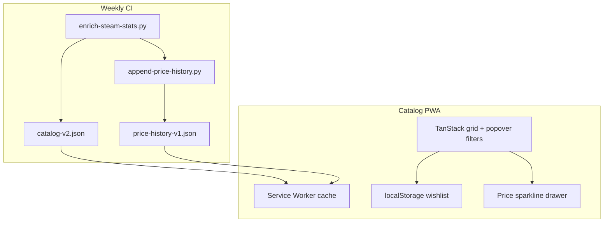

# Catalog UX v2 — Spreadsheet filters, wishlist PWA, price history

> Supersedes the Steam-stats-only plan. Execute phases in order.

## Goals

1. Fix missing Steam **review %** and **concurrent player** data (prerequisite).
2. Replace text column filters with **Excel / Google Sheets–style checkbox popovers**.
3. Expose every **play method** (`platformSupport`) as a visible, filterable column.
4. Add **device-local wishlist** with optional **PWA** install + offline catalog cache.
5. **Self-track price history** on each catalog sync; show sale/high/low graph per game when data updates.
6. **Defer SteamDB backfill** to a later optional phase ([HUMAN] ToS review).

---

## Phase 0 — Fix Steam stats enrichment (prerequisite)

**Problem:** [`scripts/sync-catalog/enrich-steam-stats.py`](scripts/sync-catalog/enrich-steam-stats.py) maps Metacritic → `reviewPercent` (137/638 titles) and never fetches `currentPlayers` (0/638).

**Fix:**

| Field | Source |
|-------|--------|
| `reviewPercent`, `reviewCount` | `GET /appreviews/{appId}?json=1&filter=all&language=english&num_per_page=0` → `round(100 * total_positive / total_reviews)` |
| `currentPlayers` | `GET /ISteamUserStats/GetNumberOfCurrentPlayers/v1/?appid={appId}` (no API key) |
| `priceUsd`, `releaseDate`, tags | Keep `appdetails` |

Add [`scripts/sync-catalog/test_enrich_steam_stats.py`](scripts/sync-catalog/test_enrich_steam_stats.py), re-enrich all 638 linked titles, extend smoke coverage asserts.

Also strip HTML from VRto3D wiki titles in [`scrape-vrto3d-wiki.py`](scripts/sync-catalog/scrape-vrto3d-wiki.py) (raw `<a href=…>` rows at top of grid).

---

## Phase 1 — Spreadsheet-style column filters

Replace the current search-input filter row in [`site/catalog/src/grid.ts`](site/catalog/src/grid.ts) with per-column **filter popovers** (funnel icon in header → dropdown panel).

### Filter UI pattern (Sheets-like)

```
┌─ Filter: Price ─────────────┐
│ Search buckets…             │
│ ☑ Select all                │
│ ☑ $0 – $4.99                │
│ ☑ $5 – $9.99                │
│ ☐ $10 – $14.99              │
│ …                           │
│ ☐ (No price data)           │
│ [Clear] [Apply]             │
└─────────────────────────────┘
```

New modules (keep files ≤250 lines):

- [`site/catalog/src/filters/ColumnFilterPopover.ts`](site/catalog/src/filters/ColumnFilterPopover.ts) — popover DOM, select-all, search-within-list
- [`site/catalog/src/filters/buckets.ts`](site/catalog/src/filters/buckets.ts) — bucket builders
- [`site/catalog/src/filters/filter-types.ts`](site/catalog/src/filters/filter-types.ts) — shared types

### Column filter types

| Column | Filter type | Bucket / value rules |
|--------|-------------|----------------------|
| Title | Text search (keep toolbar + optional contains) | — |
| 3D level | Checkbox unique values | `ultra3d`, `native3d`, … |
| Best experience | Checkbox unique labels | From `bestExperience.label` |
| TrueGame | Checkbox unique labels | From `trueGameLabel` |
| 3D Vision | Checkbox unique labels | From NVIDIA source label |
| **Play methods** (new) | Checkbox unique entries | Each `platformSupport[].label` with platform prefix |
| Hardware | Checkbox unique display names | From `DISPLAY_LABEL` map |
| Reviews | Checkbox **10% buckets** | `0–9%`, `10–19%`, … `90–100%`, `(No data)` |
| Players | Checkbox **100-player buckets** | `0`, `1–99`, `100–199`, … `9900–9999`, `10000+`, `(No data)` |
| Price | Checkbox **$5 buckets** | `$0–4.99`, `$5–9.99`, … up to max price, `(No data)` |
| Release | Checkbox by year (derived) | Parse year from `releaseDate` string |
| Buy | Checkbox | `Has Steam link` / `No link` |

TanStack Table: custom `filterFn` per column reading a `Set<string>` of selected bucket keys from popover state (not free-text).

Remove redundant toolbar platform checkboxes once Play methods column filter covers all registry keys:

`truegame`, `uevr`, `nvidia-3d-vision`, `odyssey-hub`, `reshade-depth`, `manual`, `asus-spatial-vision`

---

## Phase 2 — Play methods column

**Data already exists** in `platformSupport[]` per game; UI currently collapses to coarse `platforms[]` badges.

Add column **Play methods** rendering all entries, e.g.:

`UEVR · Works Well` · `TrueGame · 3D Ultra`

- Sort: lexicographic on joined labels
- Filter: checkbox list built from union of all `platformKey + label` pairs (~17 distinct values today; grows with sources)
- Ensure games with multiple methods show **every** path, not just `bestExperience`

Optional merge tweak in [`merge-catalog.py`](scripts/sync-catalog/merge-catalog.py): normalize display labels from [`registry-v1.json`](data/compatibility/sources/registry-v1.json) for consistency.

---

## Phase 3 — Wishlist (device-local) + PWA

### Wishlist (no account server)

- Storage: `localStorage` key `3d-catalog-wishlist-v1` → `string[]` of game `id`
- UI: ☆/★ column; toolbar toggle **Wishlist only**
- Export/import JSON button (optional, for backup)
- Privacy: never uploaded; documented in footer

**PWA is recommended but not strictly required** for localStorage. PWA adds:

- Install to home screen / desktop
- Service worker caches static assets + `catalog-v2.json` for offline browse
- [`site/catalog/public/manifest.webmanifest`](site/catalog/public/manifest.webmanifest) + [`site/catalog/public/sw.js`](site/catalog/public/sw.js) (mirror [`examples/web`](examples/web/public/sw.js) pattern)
- Register SW in [`main.ts`](site/catalog/src/main.ts); scope under `/3d-game-optimizer/catalog/`
- Vite: copy manifest/sw to `dist/`; update [`pages.yml`](.github/workflows/pages.yml) artifact paths

IndexedDB **not** needed for wishlist; consider it only if price history client cache grows large.

---

## Phase 4 — Self-tracked price history + graph

### Server-side history (FOSS, no SteamDB yet)

New artifact: [`data/compatibility/price-history-v1.json`](data/compatibility/price-history-v1.json)

```json
{
  "version": "v1",
  "updatedAt": "2026-06-15",
  "apps": {
    "1174180": {
      "lowUsd": 14.99,
      "highUsd": 59.99,
      "points": [
        { "date": "2026-06-15", "priceUsd": 17.99, "onSale": false }
      ]
    }
  }
}
```

New script [`scripts/sync-catalog/append-price-history.py`](scripts/sync-catalog/append-price-history.py):

- Runs after `enrich-steam-stats.py` in [`catalog-sync.yml`](.github/workflows/catalog-sync.yml)
- For each Steam-linked title: append today's `priceUsd` if changed or new day
- Update `lowUsd` / `highUsd`; set `onSale: true` when price drops ≥10% from rolling 30-day median (simple heuristic)
- Schema: [`data/compatibility/schema-price-history-v1.json`](data/compatibility/schema-price-history-v1.json)

Deploy `price-history-v1.json` alongside catalog in Pages artifact.

### Client graph

When catalog `meta.mergedAt` changes (compare to `localStorage` `3d-catalog-last-sync`):

- Fetch `price-history-v1.json` if online (SW cache fallback offline)
- Row expand or **Price** cell click → drawer/modal with sparkline:
  - Line chart: price over time
  - Markers on `onSale` days
  - Labels: record low, record high, current price
- Chart library: **no heavy deps** — inline SVG or lightweight FOSS lib (e.g. uPlot ~30KB) if needed; prefer SVG for static GitHub Pages

Wishlist games: prefetch history on sync notification banner ("Catalog updated — 3 wishlist prices changed").

### Phase 4b — SteamDB backfill (deferred)

- [HUMAN] Review SteamDB ToS / scraping policy
- Optional script to import historical lows for backfill into `price-history-v1.json`
- Until then, graphs show **history since tracking started** (footer disclaimer)

---

## Phase 5 — Ship & BUILD_PLAN

- Extend [`smoke-grid.mjs`](site/catalog/scripts/smoke-grid.mjs): stats coverage + filter popover mount smoke (jsdom or playwright-lite in CI optional)
- Update [`BUILD_PLAN.md`](BUILD_PLAN.md) sequential lane
- Update [`data-coverage.ts`](site/catalog/src/data-coverage.ts) footer copy
- Commit + push → Pages redeploy

---

## Architecture



---

## File touch list (estimated)

| Area | Files |
|------|-------|
| Enrich | `enrich-steam-stats.py`, `test_enrich_steam_stats.py`, `append-price-history.py` |
| Scrape | `scrape-vrto3d-wiki.py` |
| Site core | `grid.ts`, `main.ts`, `style.css`, new `filters/*`, `wishlist.ts`, `price-chart.ts` |
| PWA | `manifest.webmanifest`, `sw.js`, `index.html`, `vite.config.ts` |
| Data | `schema-price-history-v1.json`, `price-history-v1.json` (generated) |
| CI | `catalog-sync.yml`, `pages.yml` |

---

### Critique

- **Popover perf:** 686 rows × 17 play-method values is fine; build unique-value index once at load. For Title, keep text search only (686 unique titles unusable as checkbox list).
- **Bucket edge cases:** Games with no Steam stats land in `(No data)` buckets; filters must treat null distinctly from `0`.
- **PWA scope:** GitHub Pages subpath `/3d-game-optimizer/catalog/` requires correct `start_url` and SW scope; test install on mobile.
- **Price history accuracy:** Self-tracked data needs weeks of CI runs before graphs look meaningful; show "tracking since {date}" until SteamDB phase.
- **Line limits:** `grid.ts` already large — extract filter UI and chart to separate modules before adding popovers.
- **FOSS:** No proprietary chart SDKs; SteamDB deferred pending human ToS review.

---

## Implementation todos

1. **steam-enrich** — Fix enrich script + tests + full re-enrich
2. **spreadsheet-filters** — Popover UI + bucket filterFns for price/reviews/players + categorical columns
3. **play-methods-column** — Render/filter all `platformSupport` entries; remove duplicate toolbar filters
4. **wishlist-pwa** — localStorage wishlist, manifest, service worker, offline catalog cache
5. **price-history** — append-price-history.py, schema, deploy artifact, price drawer graph on sync
6. **ship** — smoke tests, BUILD_PLAN, docs, push
