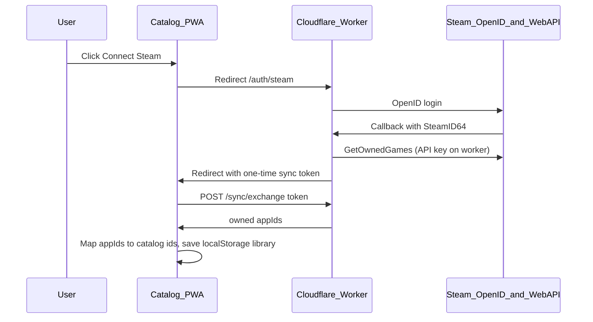

# Steam Library Sync for 3D Game Catalog

## Answer

**Yes** — you can mark catalog titles as “In library” from a user’s Steam library, but **not purely inside GitHub Pages**. Steam’s `IPlayerService/GetOwnedGames` API blocks browser CORS calls, and the browser cannot read local `steamapps/appmanifest_*.acf` files. The workable pattern is:



The desktop WinUI app already implements the same Steam API call in [`SteamLibraryClients.cs`](src/SpatialLabsOptimizer/Infrastructure/Steam/SteamLibraryClients.cs) and [`LibrarySteamOwnedMerger.cs`](src/SpatialLabsOptimizer/Infrastructure/Library/LibrarySteamOwnedMerger.cs); the catalog will reuse the **same App ID → owned set** concept, but persist to [`library.ts`](site/catalog/src/library.ts) instead of SQLite.

---

## Current state

| Piece | Today |
|-------|--------|
| Library storage | `localStorage` set of catalog `game.id` strings ([`library.ts`](site/catalog/src/library.ts)) |
| Steam link | ~638 titles have `steamAppId` in `catalog-v2.json` |
| Hosting | Static GitHub Pages ([`pages.yml`](.github/workflows/pages.yml)) — no backend |
| Desktop Steam | User-initiated `GetOwnedGames` with user’s API key + Steam ID64 ([`docs/STEAM_INTEGRATION.md`](docs/STEAM_INTEGRATION.md)) |

---

## Architecture (your chosen approach: OpenID + serverless proxy)

### 1. Cloudflare Worker (`workers/steam-library/`)

New FOSS worker with three routes:

| Route | Purpose |
|-------|---------|
| `GET /auth/steam` | Start Steam OpenID 2.0 login; `return_to` = worker callback |
| `GET /auth/steam/callback` | Verify OpenID response, extract SteamID64, call `GetOwnedGames`, mint **single-use token** in **Cloudflare KV** (TTL 300s) |
| `POST /sync/exchange` | Body `{ token }` → `{ appIds, steamIdTruncated, source: "openid" \| "user_key" }`; CORS + rate limit |
| `POST /sync/owned` | Body `{ steamId, apiKey }` — **forward-only** fallback when OpenID path returns 0 games; no persistence |

Secrets (Worker env, not in repo):

- `STEAM_WEB_API_KEY` — project key from [Steam Web API](https://steamcommunity.com/dev/apikey)
- `ALLOWED_ORIGIN` — `https://edwardlthompson.github.io`
- `CATALOG_RETURN_URL` — `https://edwardlthompson.github.io/3d-game-optimizer/catalog/`

**Why not call Steam from the catalog directly?** Steam Web API has no CORS headers for browser origins; a proxy is required.

**Why not cookies?** Catalog (`github.io`) and Worker (`*.workers.dev`) are different sites; third-party cookies are unreliable. Use **one-time token exchange** instead (see Critique mitigations below).

**Token storage:** Cloudflare KV key `sync:{uuid}` → JSON `{ appIds, steamId, consumed: false }`, TTL **300 seconds**. Not in-memory (Workers are stateless across isolates).

**Rate limits (Worker):**

- `GET /auth/steam`: 10 req / hour / IP (Cloudflare `cf-connecting-ip`)
- `POST /sync/exchange`: 20 req / hour / IP; reject reused tokens with `410 Gone`
- `POST /sync/owned`: 5 req / hour / IP; require `Origin` header match
- **No** `GET /owned?steamid=` endpoint — prevents unauthenticated bulk enumeration

Reuse existing client logic pattern from:

```87:105:src/SpatialLabsOptimizer/Infrastructure/Steam/SteamLibraryClients.cs
public async Task<IReadOnlyList<int>> GetOwnedAppIdsAsync(string apiKey, string steamId, ...)
{
    var url = $"https://api.steampowered.com/IPlayerService/GetOwnedGames/v1/?key={apiKey}&steamid={steamId}&include_appinfo=0";
    // parse response.games[].appid
}
```

### 2. Catalog client modules

**[`site/catalog/src/steam-library-sync.ts`](site/catalog/src/steam-library-sync.ts)** (new)

- `startSteamConnect(workerBaseUrl)` → redirect to worker `/auth/steam`
- `handleSteamSyncReturn()` — on load, read `?steam_sync_token=` from URL, **immediately** `history.replaceState` to strip query (before exchange completes), then POST exchange
- `mapOwnedAppIdsToCatalogIds(games, appIds)` — returns `{ matchedIds, stats }` where stats includes:
  - `catalogMatched` — titles marked in library
  - `ownedTotal` — App IDs from Steam
  - `ownedUnmatched` — owned App IDs with no catalog row (confidence ≥ 0.92)
  - `catalogNoSteamLink` — catalog titles without linkable `steamAppId`

**Extend [`site/catalog/src/library.ts`](site/catalog/src/library.ts)**

- `mergeLibraryFromCatalogIds(ids, mode: 'merge' | 'replace')` — union or replace local library set
- `exportLibrary()` / optional import (mirror wishlist pattern)

**[`site/catalog/src/main.ts`](site/catalog/src/main.ts)**

- Toolbar: **Connect Steam** + **Sync library** status line
- Banner after sync with full stats (see § Critique mitigations — incomplete coverage)
- Optional **Disconnect** (clears stored Steam sync metadata + user API key from localStorage; library checkmarks remain until user clears)

**Config:** `VITE_STEAM_SYNC_URL` in catalog build (GitHub Actions env) pointing to deployed worker URL.

### 3. Mapping rules (top score / library semantics)

- **Owned set** = full Steam library from `GetOwnedGames` (not installed-only).
- For each catalog game: if `steamAppId ∈ ownedAppIds` → add `game.id` to library.
- **Default sync mode:** `merge` (keep manual checkmarks; add Steam-owned matches).
- Offer checkbox: “Replace library with Steam sync” for users who want a clean slate.
- Titles without `steamAppId` or low match confidence stay manual-only.

### 4. Privacy and FOSS compliance

- Opt-in only: no sync until user clicks **Connect Steam** ([`.cursor/rules/foss-compliance.mdc`](.cursor/rules/foss-compliance.mdc)).
- Worker logs: SteamID hash or truncated ID only; **never** log API key or full app list.
- No library data stored server-side after token exchange (token + appIds ephemeral).
- Footer note: “Steam sync reads owned App IDs only; stored on this device.”

### 5. Deploy and CI

- Add [`workers/steam-library/wrangler.toml`](workers/steam-library/wrangler.toml) + TypeScript worker source.
- New workflow [`.github/workflows/steam-library-worker.yml`](.github/workflows/steam-library-worker.yml): deploy worker on `main` when `workers/steam-library/**` changes (requires `[HUMAN]` Cloudflare account + `CLOUDFLARE_API_TOKEN` secret).
- Update [`pages.yml`](.github/workflows/pages.yml) build step to pass `VITE_STEAM_SYNC_URL`.

### 6. Private profiles and user API key fallback

Steam returns **empty** `games` when **Game details** privacy is private and the worker uses a **project** API key (not the account owner's key).

**Detection:** After OpenID callback, if `games` array is empty **or** missing, worker still mints a token but sets `emptyLibrary: true`. Client shows a dedicated banner (not a silent failure).

**Primary recovery (no key):** Inline help with link to [Steam profile privacy](https://steamcommunity.com/my/edit/settings) → set **Game details** to **Public** → click **Retry sync** (reuses stored `steamId` in localStorage, re-runs OpenID only if expired).

**Secondary recovery (user key — same model as desktop app):**

1. Collapsible **Advanced: use my Steam Web API key** panel (mirrors [`LibrarySettingsView.xaml`](src/SpatialLabsOptimizer/Views/LibrarySettingsView.xaml)).
2. Key stored in `localStorage` key `3d-catalog-steam-api-key-v1` only — never sent except in `POST /sync/owned` body.
3. Worker forwards to `GetOwnedGames`, returns appIds, **does not log or store** the key (request-scoped only).
4. Validate key belongs to same Steam ID: if Steam returns `403` or empty, show "Key must match your Steam account."
5. **Disconnect** clears key + `steamId` metadata.

**Why both paths:** OpenID alone is one-click for public profiles; user key path covers the common private-library case without forcing privacy changes.

---

## Critique mitigations

Each original risk is handled explicitly in design and acceptance criteria.

### 1. Private profiles return 0 games

| Mitigation | Implementation |
|------------|----------------|
| Detect empty response | Worker sets `emptyLibrary: true` on token payload; client branches to privacy-help banner |
| Privacy instructions | Step-by-step: Profile → Edit Profile → Privacy Settings → Game details → Public |
| User API key fallback | `POST /sync/owned` forward-only; key in localStorage; same UX as desktop Library Settings |
| Retry without re-login | Persist `steamId` + `lastSyncAt` locally; **Retry** re-fetches via user-key path or re-OpenIDs if session stale |
| Acceptance test | Mock empty `GetOwnedGames` → banner shows; mock with user key → library populates |

### 2. Cross-origin token in URL

| Mitigation | Implementation |
|------------|----------------|
| Short TTL | KV entry expires in **5 minutes** |
| Single use | On exchange, delete KV key or set `consumed: true`; second exchange returns `410` |
| Strip URL immediately | Client calls `history.replaceState({}, "", pathname)` **before** awaiting fetch (prevents referrer leakage on in-page navigation) |
| No token in logs | Worker access logs omit query strings; GitHub Pages referrer policy unchanged |
| HTTPS only | Worker rejects non-HTTPS redirects |

### 3. Worker abuse

| Mitigation | Implementation |
|------------|----------------|
| No open lookup API | Only token exchange after completed OpenID; no `steamid` query param endpoint |
| Per-IP rate limits | Cloudflare Worker rate limiter on auth + exchange + owned routes (see §1 Worker) |
| Token entropy | `crypto.randomUUID()` for sync tokens (122 bits) |
| CORS allowlist | `Access-Control-Allow-Origin` = exact `ALLOWED_ORIGIN` env only |
| Key forwarding abuse | `/sync/owned` capped at 5/hr/IP; request body max 512 bytes |

### 4. Incomplete catalog coverage (~48 titles without Steam App ID)

| Mitigation | Implementation |
|------------|----------------|
| Transparent stats | Post-sync banner: "**142** catalog titles matched · **891** owned on Steam · **749** owned games not in catalog" |
| Unmatched is normal | Copy explains: catalog is 3D-focused subset, not full Steam library |
| Optional detail | "Show unmatched count" expands; no full app list download by default (privacy) |
| Manual checkmarks preserved | Default **merge** mode; titles without `steamAppId` stay user-toggled |
| Confidence gate | Only match `steamMatchConfidence >= 0.92` to avoid false library marks |
| Future | Desktop export bridge (out of scope) can supplement edge cases |

### 5. Human setup blockers (Cloudflare + Steam API key)

| Mitigation | Implementation |
|------------|----------------|
| Operator doc | [`docs/STEAM_CATALOG_SYNC.md`](docs/STEAM_CATALOG_SYNC.md) with checklist: Cloudflare account, `wrangler login`, create API token, register Steam Web API key, add GitHub secrets |
| BUILD_PLAN gate | Add Sequential lane item labeled `[HUMAN]` — "Deploy steam-library Worker + set `STEAM_WEB_API_KEY` secret" before marking feature shipped |
| Graceful degradation | If `VITE_STEAM_SYNC_URL` unset at build time, **Connect Steam** button hidden; manual library checkmarks still work |
| Local dev | `wrangler dev` + `.dev.vars` template (`.dev.vars.example`, gitignored) for agent testing |
| CI secrets doc | List required secrets: `CLOUDFLARE_API_TOKEN`, `CLOUDFLARE_ACCOUNT_ID`, `STEAM_WEB_API_KEY` |

---

## Acceptance criteria (ship gate)

- OpenID flow marks owned catalog titles in library (merge mode).
- Empty Steam response shows privacy help, not silent failure.
- User API key path works when project key returns empty.
- Token cannot be exchanged twice; URL param stripped on load.
- Sync banner shows matched + unmatched counts.
- Connect Steam hidden when worker URL not configured.
- `[HUMAN]` checklist completed and documented in `docs/STEAM_CATALOG_SYNC.md`.

---

## Files to touch

| File | Change |
|------|--------|
| `workers/steam-library/src/index.ts` | OpenID + GetOwnedGames + token exchange |
| `workers/steam-library/wrangler.toml` | Worker config |
| `site/catalog/src/steam-library-sync.ts` | Client orchestration |
| `site/catalog/src/library.ts` | Merge/replace helpers |
| `site/catalog/src/main.ts` | Connect Steam UI |
| `site/catalog/src/style.css` | Button/banner styles |
| `.github/workflows/steam-library-worker.yml` | Deploy worker |
| `.github/workflows/pages.yml` | Inject `VITE_STEAM_SYNC_URL` |
| `docs/STEAM_CATALOG_SYNC.md` | User + operator docs |

---

## Out of scope (later)

- Desktop app → catalog JSON export bridge (easy follow-up using existing owned-games merge).
- Installed-only scan in browser (impossible without native app).
- Auto-sync on interval (conflicts with user-initiated privacy model).

