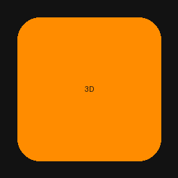
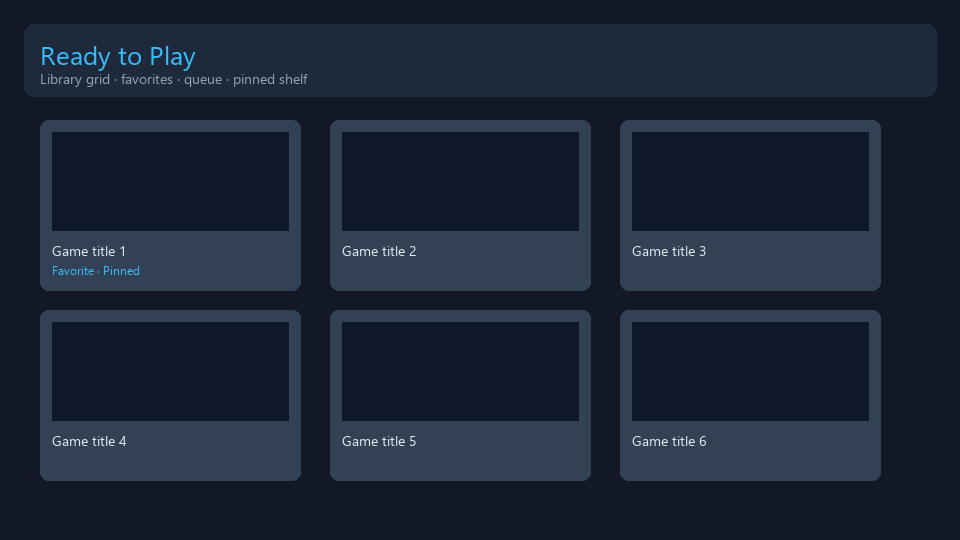
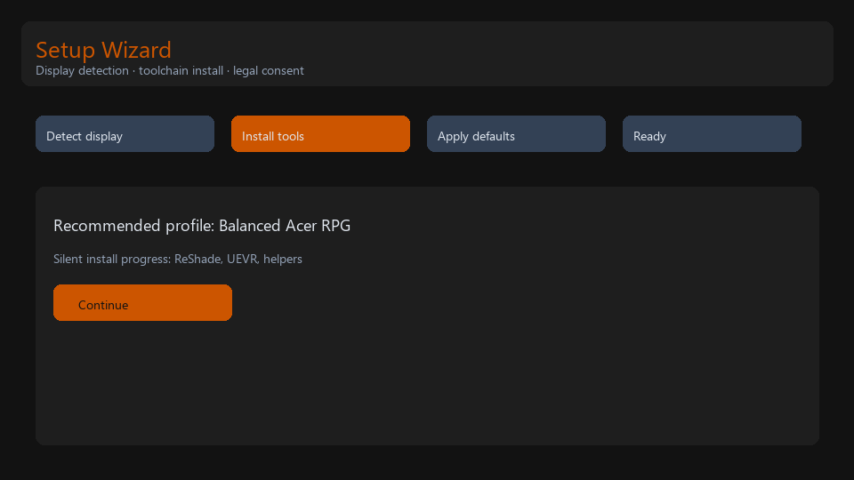
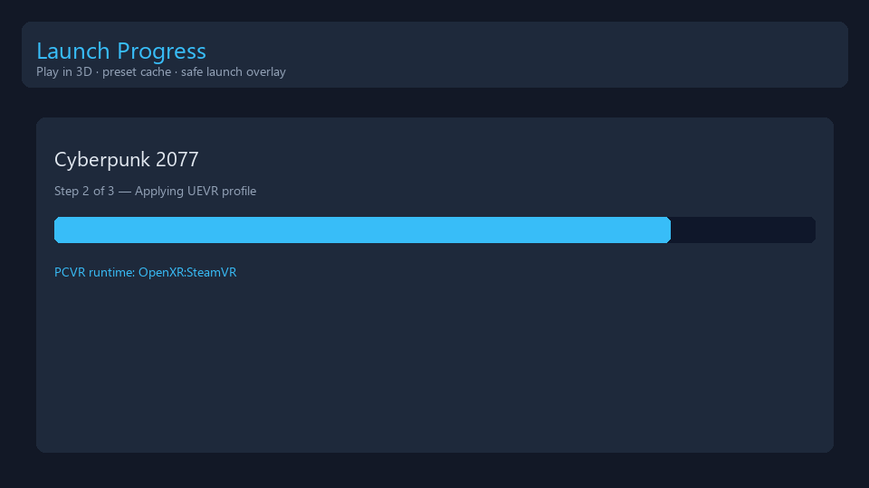
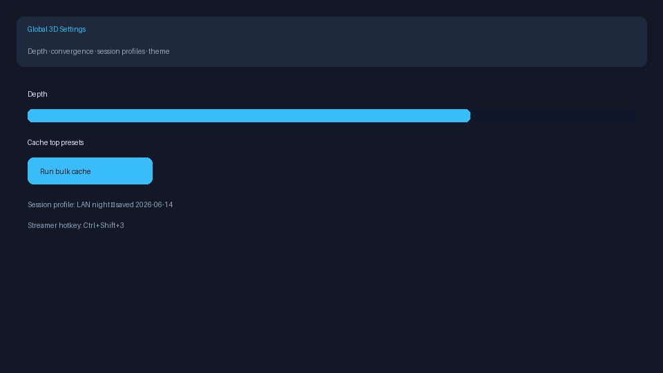

<div align="center">



# 3D Game Optimizer


_Product releases: tags `SpatialLabsOptimizer-v*`. Template bootstrap: `v*` matching `.template-version`._

**One-click glasses-free 3D PC gaming** — discovery library, silent toolchain setup, zero-friction launch.

[Releases](https://github.com/edwardlthompson/3d-game-optimizer/releases) · [**3D Game Catalog**](https://edwardlthompson.github.io/3d-game-optimizer/catalog/) · [Build from source](#build-from-source) · [Documentation](#documentation)

</div>

## At a glance

| | |
|---|---|
| **Displays** | Acer SpatialLabs · Samsung Odyssey 3D · NVIDIA 3D Vision (legacy) · Manual fallback |
| **Library** | Steam discovery hub — sort by **Game Rank** (Steam + 3D), players online, Wilson reviews; filter by **Min 3D quality** |
| **Catalog site** | Public [3D Game Catalog](https://edwardlthompson.github.io/3d-game-optimizer/catalog/) — browse titles, **Connect Steam** for Lib checkmarks, sort by Game Rank |
| **Launch** | **Play in 3D** — silent presets, no ReShade/UEVR config dialogs |
| **Privacy** | Local-first · zero telemetry · optional Steam API key only · no cloud sync |

## Quick start

1. Download the latest **Release** (or build from source below).
2. Run **Setup Wizard** — display detect, silent vendor/community toolchain install, optimal defaults.
3. Open **Ready to Play** in the library → click **Play in 3D**.

> **Requires:** Windows 11, .NET 8 runtime, a supported glasses-free 3D display (or manual generic profile).

## 3D Game Catalog (web)

Browse the living multi-source 3D compatibility database in your browser — no install required:

**https://edwardlthompson.github.io/3d-game-optimizer/catalog/**

The catalog merges **686 lenticular 3D titles** from Acer TrueGame (~222), UEVR profiles (~471), VRto3D wiki, Samsung Odyssey Hub seed, ReShade depth curated list, and NVIDIA 3D Vision Ready. Sort and filter like a lightweight SteamDB view, plus 3D-specific columns:

| Column | What it shows |
|--------|----------------|
| **Best experience** | Highest-quality path (e.g. Acer TrueGame · 3D Ultra vs UEVR · Works Well) |
| **3D level** | 3D Ultra · 3D · Optimized · Experimental |
| **TrueGame / UEVR / 3D Vision** | Source-specific badges and ratings |
| **Buy on Steam** | Purchase link when Steam app ID confidence ≥ 0.92 (~638 titles) |
| **Platforms** | TrueGame, UEVR, NVIDIA 3D Vision, manual curated, … |
| **Hardware** | Required display stack (SpatialLabs, Odyssey 3D, legacy 3D Vision, generic stereo) |
| **Steam Store** | Reviews, players, release date, price (when enriched) |

- **Connect Steam** — one-click OpenID sync marks owned titles in your browser library (requires operator-deployed worker; see [docs/STEAM_CATALOG_SYNC.md](docs/STEAM_CATALOG_SYNC.md))
- No cookies or analytics — static GitHub Pages site
- Same `catalog-v2.json` the desktop app indexes for the 3D-only library view
- Deep link a game: `?appId=1174180` (Steam app ID)

Data maintenance: [docs/SEED_MAINTENANCE.md](docs/SEED_MAINTENANCE.md) · Site source: [`site/catalog/`](site/catalog/)

> **Note:** The site publishes on push to `main` via GitHub Actions. Enable **Pages → Build and deployment → GitHub Actions** in repo settings if the link 404s until the first deploy completes.

<details>
<summary><b>✨ Features</b></summary>

**Library & discovery**
- Launcher-style box cover art from Steam Store API + CDN cache
- **3D-only library** — installed titles that appear in the merged catalog (not your full Steam library)
- Public **[3D Game Catalog](https://edwardlthompson.github.io/3d-game-optimizer/catalog/)** webpage — sort/filter all known 3D titles
- Sort by **Game Rank** (72% weighted Steam popularity + 28% best 3D path), players online, Steam reviews, name, genre
- **Min 3D quality** filter — Any through Ultra (26–88+), matching the catalog site tiers
- Condensed library toolbar; game metadata in a detail popup on thumbnail click
- Resizable **Recent launches** panel with drag grip
- Cover art prefetch fixes; letterboxed thumbnails (no crop); auto preset cache on discovery
- Pinned shelf, queue enqueue, favorites, session playlists, local game folder watch list

**One-click launch**
- Automatic platform routing: TrueGame, Odyssey 3D Hub, UEVR, ReShade
- Pre-cached community presets — zero tool GUIs before play
- Launch progress overlay with step-by-step readout
- Automatic config rollback on failure (restore UI coming soon)

**Hardware & performance**
- Quick system specs scan + optional benchmark mode
- Performance-tier preset variants (depth, shader cost)

**Trust & compatibility**
- Trainer/mod manager coexistence (WeMod, Vortex, MO2 — detect, game-first launch)
- In-app updates (About → Check now / Update and restart) from GitHub releases
- Safe launch (no injectors) for debugging
- Structured error codes (`3DGO-####`) + diagnostic bundle export

</details>

<details>
<summary><b>🖥️ Supported displays</b></summary>

| Vendor | Models (examples) | Hub software |
|--------|-------------------|--------------|
| Acer | SpatialLabs PSV27-2, 15" laptops | Experience Center, SR Platform, TrueGame |
| Samsung | Odyssey 3D G90XF | Odyssey 3D Hub ≥ 1.3.5 |
| NVIDIA | Legacy 3D Vision monitors | Stereoscopic 3D Driver (deprecated) |
| Generic | Manual picker | Community tools only (UEVR / ReShade) |

See [docs/DISPLAY_VENDORS.md](docs/DISPLAY_VENDORS.md) for EDID signatures and install notes.

</details>

<details>
<summary><b>📸 Screenshots</b></summary>

<div align="center">

| Library | Setup wizard |
|:---:|:---:|
|  |  |
| Launch progress | Settings |
|  |  |

</div>

Assets live in `docs/assets/readme/` (regenerate UI previews via `python scripts/generate-brand-assets.py`). The script skips real WinUI screenshots when the Windows App SDK / WinUI runtime is unavailable and falls back to synthetic placeholders. Replace with real WinUI captures before major releases if desired.

</details>

<details>
<summary><b>🔒 Privacy & legal</b></summary>

3D Game Optimizer is an **independent open-source utility**. It is not affiliated with Acer, Samsung, Valve, Steam, NVIDIA, ReShade, UEVR, WeMod, or any other third party.

- No telemetry, crash reporting, or data sharing (including opt-in)
- All processing is local-first; HTTP is allowlist-only (`PrivacyGuard`)
- Cover art is cached locally for display — not redistributed

- [Privacy policy](docs/PRIVACY.md)
- [Legal & disclaimers](docs/LEGAL.md)
- [Trademark attributions](docs/TRADEMARKS.md)

</details>

<details>
<summary><b>🛠️ Build from source</b></summary>

**Prerequisites:** Windows 11, Visual Studio 2022 or Build Tools, Windows App SDK 1.6+, .NET 8 SDK

```powershell
git clone https://github.com/edwardlthompson/3d-game-optimizer.git
cd 3d-game-optimizer
dotnet build SpatialLabsOptimizer.sln
dotnet test SpatialLabsOptimizer.sln
```

Run the app:

```powershell
dotnet run --project src/SpatialLabsOptimizer/SpatialLabsOptimizer.csproj
```

**v2 features** (Epic/GOG local install scan, workshop importer, LAN export, hybrid co-op) are off by default. Enable locally:

```powershell
# Option A — helper script
.\scripts\run-dev-v2.ps1

# Option B — launch profile (IDE / dotnet run)
dotnet run --project src/SpatialLabsOptimizer/SpatialLabsOptimizer.csproj --launch-profile "SpatialLabsOptimizer (v2)"

# Option C — session env var
$env:SPATIALLABS_ENABLE_V2 = "true"
dotnet run --project src/SpatialLabsOptimizer/SpatialLabsOptimizer.csproj
```

In Visual Studio or Cursor, pick the **SpatialLabsOptimizer (v2)** profile from `Properties/launchSettings.json`.

</details>

<details>
<summary><b>🤝 Contributing</b></summary>

- Compatibility seed PRs: see [docs/SEED_MAINTENANCE.md](docs/SEED_MAINTENANCE.md)
- Architecture decisions: `docs/adr/`
- Task board: [BUILD_PLAN.md](BUILD_PLAN.md) — respect `[AGENT]` / `[HUMAN]` labels

</details>

<details>
<summary><b>🗺️ Roadmap</b></summary>

| Version | Focus |
|---------|--------|
| **v1.0** | WinUI hub, silent setup, discovery library, Play in 3D, multi-vendor displays |
| **v1.0.1** | Incremental Steam scan, bulk preset cache, HDR watchdog |
| **v1.1.0** | Local release (zip/MSI), local game folders, About updates, PCVR/command palette, diagnostics |
| **v1.2.0** | Game Rank library sort, Min 3D quality filter, cover art & preset prefetch, condensed library UX |
| **v1.3.0** | GitHub-only distribution (zip + MSI); MSIX and WinGet removed; catalog/worker hardening |
| **v1.4.0** | Catalog **Connect Steam** (OpenID + Cloudflare Worker); Lib sync, security hardening, test/CI expansion |
| **v2.0** | Epic/GOG local install metadata, workshop importer, LAN export, hybrid co-op |

Detail: [BUILD_PLAN.md](BUILD_PLAN.md)

</details>

<details>
<summary><b>❓ FAQ</b></summary>

**Do I need a Steam API key?**  
No for basic use. Optional key unlocks owned-library merge and live player counts. Reviews and covers work without a key.

**Does this replace Steam, TrueGame, or Odyssey Hub?**  
No — it connects to and automates them. You still need vendor display software installed.

**Will this work with WeMod?**  
Yes — enable **Trainer coexistence** in Toolchain Health. The app detects WeMod/Vortex/MO2 and can launch the game first (skipping UEVR injectors when configured). With coexistence off, launch is blocked if a conflicting trainer is running (`3DGO-0004`). You are responsible for game ToS compliance.

**Does it support VR headsets?**  
**Play in VR** delegates to your existing SteamVR/OpenXR install. OpenXR runtime can be overridden from settings.

**Is my data sent anywhere?**  
No. Outbound HTTP is limited to Steam APIs, Steam CDN, signed GitHub release manifests (`api.github.com`), and optional SteamGridDb when configured.

</details>

<details>
<summary><b>📚 Documentation</b></summary>

| Doc | Topic |
|-----|--------|
| [BUILD_PLAN.md](BUILD_PLAN.md) | Sprint task board |
| [docs/SEED_MAINTENANCE.md](docs/SEED_MAINTENANCE.md) | Catalog v2 merge & validation |
| [site/catalog/README.md](site/catalog/README.md) | GitHub Pages catalog browser |
| [docs/DISPLAY_VENDORS.md](docs/DISPLAY_VENDORS.md) | Display catalog & hubs |
| [docs/STEAM_CATALOG_SYNC.md](docs/STEAM_CATALOG_SYNC.md) | Catalog Connect Steam (worker + OpenID) |
| [docs/STEAM_INTEGRATION.md](docs/STEAM_INTEGRATION.md) | API-first data policy |
| [docs/TOOL_AUTOMATION.md](docs/TOOL_AUTOMATION.md) | Silent install contracts |
| [docs/UX_PROGRESS.md](docs/UX_PROGRESS.md) | Progress feedback policy |
| [docs/DESIGN_SYSTEM.md](docs/DESIGN_SYSTEM.md) | UI tokens & interaction |
| [docs/QA_MATRIX.md](docs/QA_MATRIX.md) | Release QA hardware matrix |
| [docs/LOCAL_RELEASE.md](docs/LOCAL_RELEASE.md) | Local zip/MSI build & sign |
| [docs/LOCAL_GAME_FOLDERS.md](docs/LOCAL_GAME_FOLDERS.md) | Watch-list folder scanning |
| [docs/TRAINER_COEXISTENCE.md](docs/TRAINER_COEXISTENCE.md) | WeMod/mod-manager launch policy |

</details>

## Agent bootstrap

Child repo of [agent-project-bootstrap](https://github.com/edwardlthompson/agent-project-bootstrap) **v0.7.1**.

| Track | Version | Tag pattern | Workflow |
|-------|---------|-------------|----------|
| **Product** | 1.4.0 | `SpatialLabsOptimizer-v*` | `product-release.yml` |
| **Template** | 0.7.1 | `v*` | `release.yml` |

**Active stacks:** WinUI (`src/`), web catalog (`site/catalog/`), Cloudflare worker (`workers/steam-library/`), Python sync (`scripts/sync-catalog/`). Inactive template stubs under `examples/` — see [docs/OPTIONAL_STACKS.md](docs/OPTIONAL_STACKS.md).

Task board and migration status: [BUILD_PLAN.md](BUILD_PLAN.md) · Agent memory: [AGENT_MEMORY.md](AGENT_MEMORY.md)

**Cursor slash commands:** type `/` in Agent chat — [`/.cursor/commands/README.md`](.cursor/commands/README.md) (`/build`, `/gates`, `/ship`, `/audit`, …)

---

<div align="center">

MIT License · Built with [agent-project-bootstrap](https://github.com/edwardlthompson/agent-project-bootstrap)

</div>
